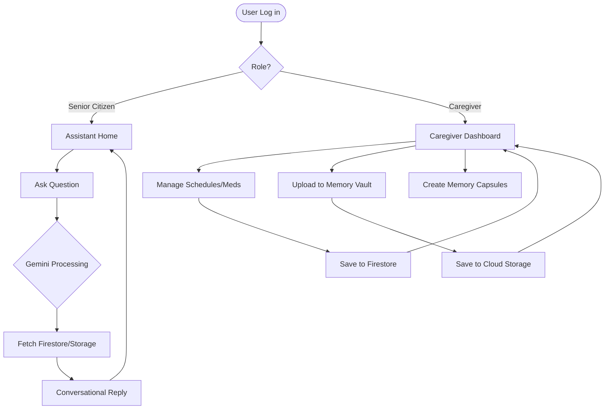

# Product Requirements Document (PRD)

**Project:** MemoLink AI
**Date:** 2026-07-01
**Version:** 0.1
**Owner:** [To be defined]
**Status:** Draft
**Last reconciled:** N/A - first draft
**BRD:** N/A

---

## 1. Product Purpose & Value Proposition

MemoLink AI is an AI-powered cognitive companion designed to assist senior citizens experiencing age-related memory decline, mild cognitive impairment, or everyday forgetfulness. The platform helps users manage daily routines, medications, appointments, and personal memories through a simple and intuitive conversational interface. 

Unlike conventional AI assistants that rely on general knowledge, MemoLink AI integrates artificial intelligence with a secure personal memory database, allowing users to retrieve important information through natural language queries. By organizing essential life information in one platform, MemoLink AI promotes independence while reducing the burden on caregivers.

---

## 2. Target Personas

**Primary Persona — Senior Citizens**
- *Who they are:* Individuals navigating everyday life with memory challenges, age-related memory decline, or mild cognitive impairment.
- *Their core frustration:* Forgetting medication schedules, appointments, routines, or important personal events, leading to increased dependence on family members.
- *What success looks like for them:* Accessing their own stored memories, schedules, and routines simply by asking questions in natural language.

**Secondary Persona — Caregivers & Family Members**
- *Who they are:* Relatives, professional caregivers, or healthcare providers supporting the primary user.
- *Their core frustration:* The burden of constantly reminding seniors about daily tasks and maintaining updated records.
- *What success looks like for them:* A centralized dashboard to manage schedules, update medications, and curate memories, ensuring the senior is well-supported.

---

## 3. Core Features & Priorities

| ID | Feature | Description | Priority |
|----|---------|-------------|----------|
| PRD-F1 | Conversational Memory Assistant | Natural language Q&A interface using Gemini API to retrieve stored records without complex navigation. | Must-Have |
| PRD-F2 | Smart Schedule Management | Organize daily routines, medical appointments, and personal events accessible via voice/text queries. | Must-Have |
| PRD-F3 | Medication Management | Record medications (name, dosage, schedule) and provide reminders/answers about current medicine needs. | Must-Have |
| PRD-F4 | Caregiver Dashboard | Interface for caregivers to manage schedules, medications, and upload memories for the senior user. | Must-Have |
| PRD-F5 | AI Memory Journal | Digital journal for recording daily activities with automatic AI summarization for easy review. | Should-Have |
| PRD-F6 | Memory Vault | Secure storage for photographs, voice recordings, videos, letters, and documents. | Should-Have |
| PRD-F7 | Memory Capsules | Digital memory collections presented on significant dates (birthdays, anniversaries) to encourage reminiscence. | Nice-to-Have |

---

## 4. User Stories & Acceptance Criteria

**US-01 — Conversational Querying**
> As a senior citizen, I want to ask the assistant "What are my appointments today?" so that I know my schedule without navigating menus.

Acceptance Criteria:
- Given the user has stored appointments for the day, when they ask about them, the AI retrieves the specific details and responds conversationally.
- Given the user has no appointments, the AI politely informs them that their schedule is clear.

**US-02 — Medication Management & Reminders**
> As a caregiver, I want to input medication schedules into a dashboard so that the senior gets accurate reminders.

Acceptance Criteria:
- Caregivers can add, edit, and delete medications with name, dosage, and schedule.
- The senior user receives a notification (via Firebase Cloud Messaging) when it is time to take a medication.

**US-03 — Memory Vault & Capsules**
> As a family member, I want to upload photos and create a "Memory Capsule" for a birthday so that the senior user can revisit cherished memories.

Acceptance Criteria:
- Caregivers can upload media to a designated Memory Capsule with a specific trigger date.
- On the trigger date, the senior user's interface highlights the Memory Capsule for viewing.

---

## 5. App Flow & UX Intent

### 5.1 Screen Inventory

| Section | Purpose | States to design |
|--------|---------|------------------|
| Assistant Home (Seniors) | Main conversational interface (chat/voice) for natural language queries. | Idle, Listening, Processing, Responding |
| Dashboard Home (Caregivers) | Overview of senior's status, upcoming schedule, and medication adherence. | Standard rendering |
| Schedule & Meds Manager | CRUD interface for Caregivers to manage routines and prescriptions. | Standard rendering, Edit modal |
| Memory Vault | Gallery and upload interface for media and journal entries. | Grid view, Detail view, Upload form |
| Memory Capsules | Interface to curate specific memories for milestones. | Configuration state, Presentation state |

### 5.2 App Flow

---

## 6. Out of Scope for This Release

- Integration with external Electronic Health Records (EHR) systems or hospital databases.
- Automated vital sign tracking (e.g., smartwatch integration).
- Real-time video calling or messaging between seniors and caregivers within the app.

---

## 7. AI / Agent Feature Specifications

- **Gemini API:** Used as the core conversational engine. It must strictly use context provided from the user's secure database (Firestore) to answer queries, minimizing hallucinations.
- **AI Memory Journal:** Summarization tasks triggered automatically at the end of the day to condense journal entries into easy-to-read formats.

---

## 8. Dependencies & Assumptions

**Dependencies:**
- Gemini API availability and context window limits.
- Firebase Auth / Supabase Auth for role-based access control.
- Cloud Firestore / Supabase for structured data.
- Google Cloud Storage for media assets.
- Firebase Cloud Messaging for push notifications.

**Assumptions:**
- Seniors have access to a smartphone, tablet, or web browser capable of running the application.
- The UI for seniors will be highly accessible (large fonts, high contrast, minimal interactive elements).
- Caregivers will be primarily responsible for the initial data entry (schedules, medications).

---

## 9. Implementation Plan

| # | Phase / Milestone | Entry criteria | Exit criteria (Definition of Done) | Deliverable | Depends on | Owner (DRI) | Top risk |
|---|-------------------|----------------|-------------------------------------|-------------|------------|-------------|----------|
| M1 | Infrastructure & Auth | PRD approved | Firebase/Supabase projects set up, roles (Senior/Caregiver) defined. | Configured backend | — | Backend Team | Security of health/personal data |
| M2 | Caregiver Dashboard | M1 Complete | Caregivers can perform CRUD operations on schedules, meds, and memories. | Working dashboard UI | M1 | Frontend Team | Complex state management |
| M3 | Conversational AI Integration | M2 Complete | Gemini API integrated, securely querying user data from Firestore. | AI Assistant module | M2 | AI/Backend Team | Hallucinations or slow response times |
| M4 | Senior UI & Reminders | M3 Complete | Accessible UI implemented, FCM notifications firing accurately. | Complete Senior App | M3 | Frontend Team | Notification reliability |
| M5 | Testing & QA | Code complete | Edge cases tested (e.g., overlapping schedules), UI accessibility audited. | Tested Release | M4 | QA Team | Usability issues for target demographic |

**Rollout strategy:** Alpha testing with a small group of seniors and their immediate family members, followed by a phased Beta rollout.

**Rollback plan:**
- *Trigger criteria:* Critical data breach, severe AI hallucinations, or failure of medication reminders.
- *Revert mechanism:* Disable the AI integration (failover to manual schedule view) and revert to the last stable build.
