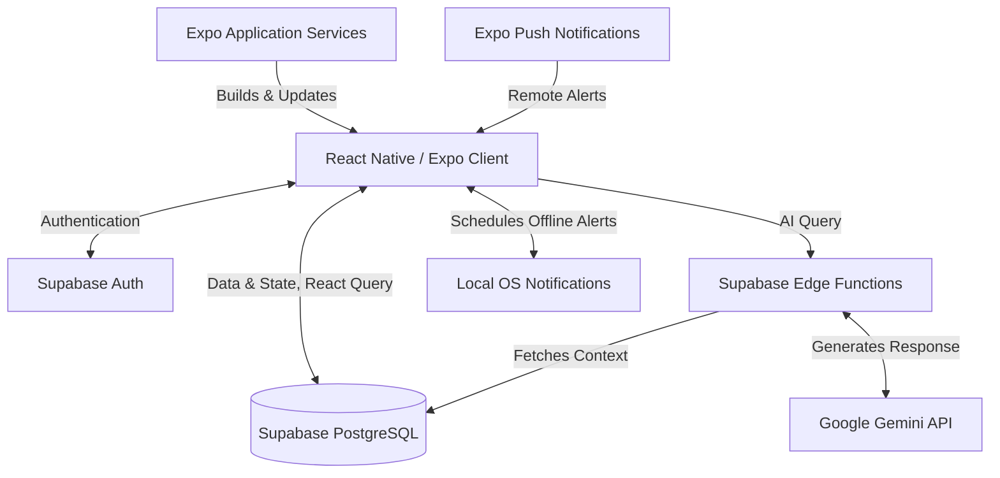

# System Design Document (SDD)

**Project:** MemoLink AI
**Date:** 2026-07-01
**Version:** 0.1
**Owner:** [To be defined]
**Status:** Draft
**Last reconciled:** N/A - first draft
**PRD:** [docs/prd.md](docs/prd.md)

---

## 1. Architectural Vision & Principles

**Architecture style:** Cloud-First Mobile Application (React Native / Expo Router) with robust local caching.

**Guiding principles:**
- **Accessibility First:** High contrast, large touch targets, voice-first interactions tailored for seniors.
- **Offline Reliability:** Core features like medication reminders must work without an active internet connection.
- **Privacy by Design:** Strict data isolation via Row Level Security (RLS) and centralized AI query processing to protect data.
- **Caregiver Visibility:** Real-time synchronization between senior actions and the caregiver dashboard for peace of mind.

**Key trade-offs made:**
- **Edge Functions over Direct Client-Side AI:** To protect Gemini API keys and centralize prompt engineering, AI interactions are routed through secure Supabase Edge Functions rather than direct client-to-Gemini requests, introducing a slight latency overhead for increased security.
- **Local Scheduling vs Full Offline DB Sync:** Opted for React Query caching paired with `expo-task-manager` and `expo-notifications` for medication reminders rather than a heavy full-sync DB (like WatermelonDB), prioritizing a lighter client payload and simpler architecture while still achieving offline reliability for critical alerts.

---

## 2. High-Level Architecture

### Stack Components

| Layer | Technology | Responsibility |
|-------|------------|----------------|
| Client | React Native (Expo Router) | Cross-platform UI, routing, and device APIs |
| Styling | NativeWind (Tailwind CSS v4) | Utility-first styling adapted for React Native |
| State Management | React Query (TanStack) | Server state caching and offline data persistence |
| Database & Auth | Supabase (PostgreSQL) | Relational database, user authentication, RLS |
| AI Integration | Supabase Edge Functions + Gemini API | Secure prompt assembly, context retrieval, and AI generation |
| Notifications | Expo Notifications (EAS) | Local scheduling (offline) and remote push notifications |

---

## 3. Data Architecture

The project utilizes a relational PostgreSQL database provided by Supabase.

### Core Data Models

- **Users:** Stores user profiles, distinguishing between roles (`senior`, `caregiver`).
- **Caregiver_Senior_Mapping:** Junction table linking caregivers to their assigned seniors.
- **Medications:** Records prescriptions, dosages, and administration schedules.
- **Events/Appointments:** Stores scheduled activities, appointments, and daily routines.
- **Memories:** Secure vault metadata pointing to Supabase Storage objects (photos, voice recordings, journal entries).

### Client-Side State

- **Server State Caching:** Managed by React Query. Query data (medications, appointments) is cached locally so it can be viewed when offline.
- **Local Reminders:** Managed by `expo-task-manager` and `expo-notifications` to ensure critical medication alerts fire even if the device loses connectivity.

---

## 4. API Design & External Integrations

### Outbound AI Interactions

| Integration | Flow | Purpose |
|-------------|------|---------|
| Conversational AI | Client -> Supabase Edge Function -> Gemini API -> Client | Natural language Q&A. The Edge Function injects user data from PostgreSQL as RAG context before querying Gemini to minimize hallucinations. |
| AI Memory Journal | Supabase Cron -> Edge Function -> Gemini API -> PostgreSQL | Nightly batch processing to summarize the day's journal entries. |

---

## 5. Security & Authorization

- **Row Level Security (RLS):** Supabase Auth dictates RLS policies. A senior can only access their own data. A caregiver can only read/write data for mapped seniors.
- **Protected Secrets:** Gemini API keys and Supabase Service Role keys are stored securely as environment variables in Supabase Edge Functions, never exposed to the client bundle.
- **Data Privacy:** Sensitive memory vault assets in Supabase Storage are locked behind Auth policies preventing unauthorized direct URL access.

---

## 6. Infrastructure, CI/CD & Deployment

**Backend Hosting:** Supabase Platform (Database, Auth, Storage, Edge Functions).
**App Hosting & Builds:** Expo Application Services (EAS).

### Build Configuration

- **EAS Build:** Cloud compilation of iOS (.ipa / App Store) and Android (.apk / .aab / Play Store) binaries.
- **EAS Update:** Over-The-Air (OTA) updates for rapid deployment of JS/React code changes without app store review.
- **Environment Management:** `eas.json` manages `development`, `preview`, and `production` profiles.

### Deployment Pipeline

- `main` branch merges trigger EAS Update / EAS Build via GitHub Actions.
- Edge functions are deployed to Supabase via Supabase CLI (`supabase functions deploy`).

---

## 7. Non-Functional Requirements

| Requirement | Target | Notes |
|-------------|--------|-------|
| AI Response Latency | < 3.0s | Target turnaround time for Gemini queries routed through Edge Functions. |
| Offline Availability | 100% (for alerts) | Scheduled medication notifications must fire natively on the device clock. |
| Accessibility | WCAG AA equivalent | Implemented via React Native `accessibilityRole`, `accessibilityLabel`, dynamic type support, and high contrast NativeWind classes. |
